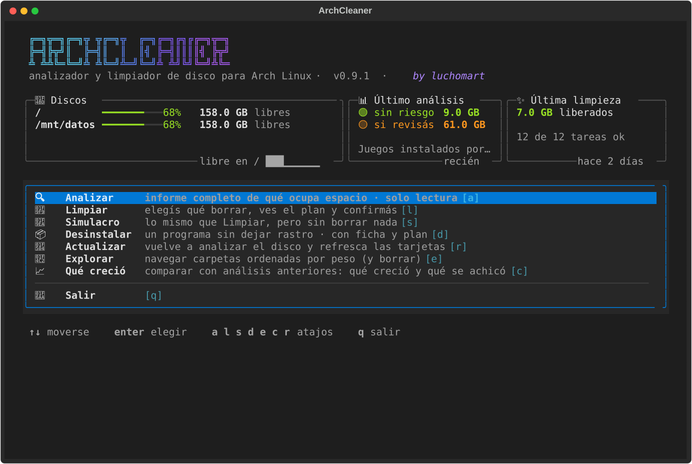
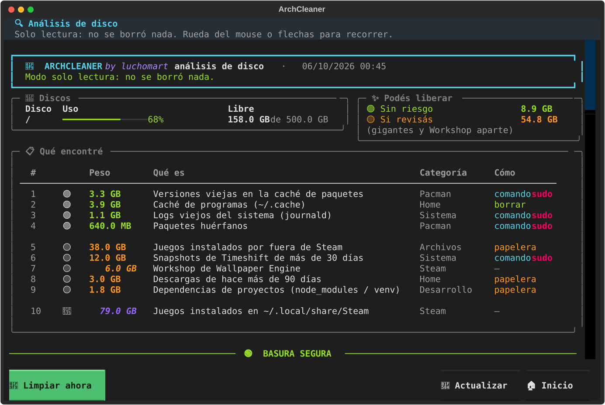
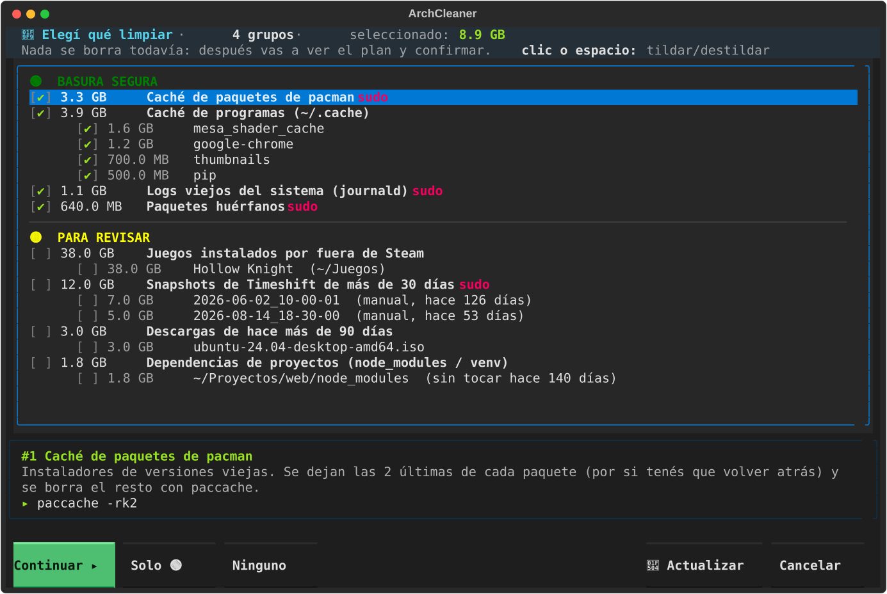
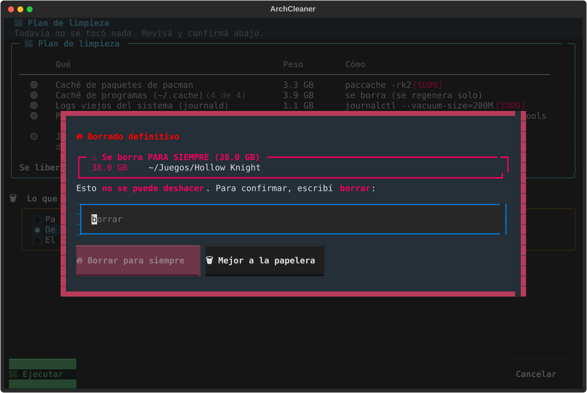
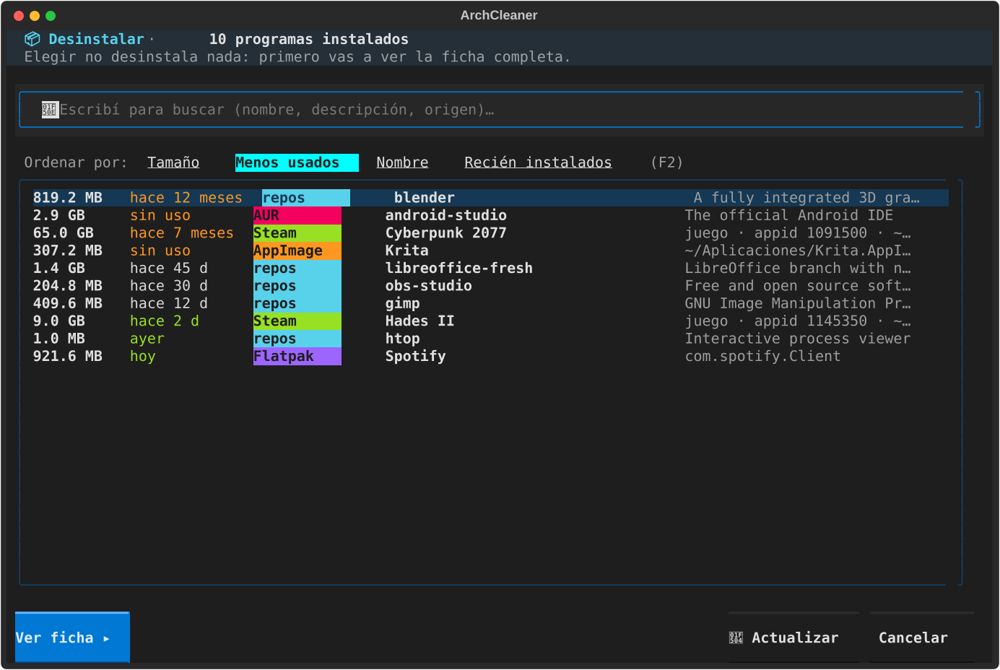
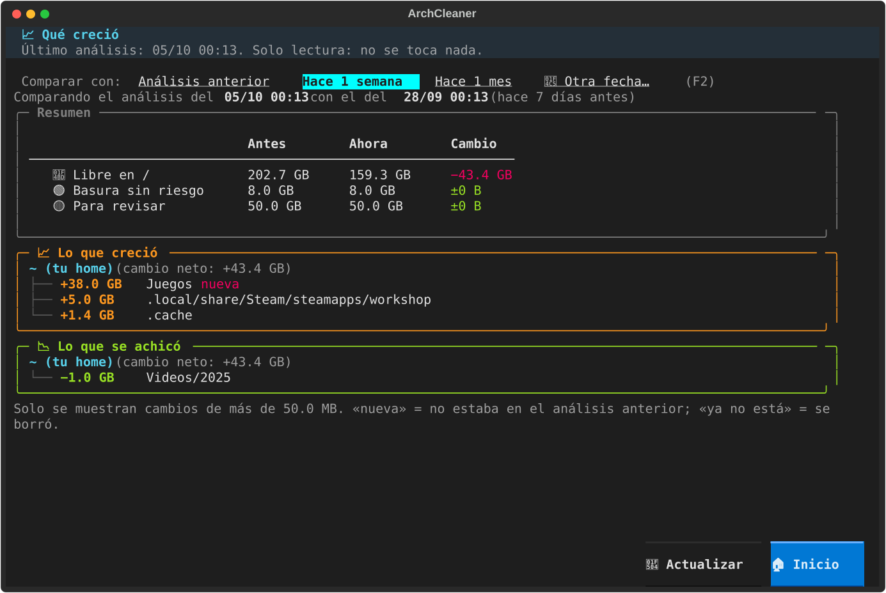
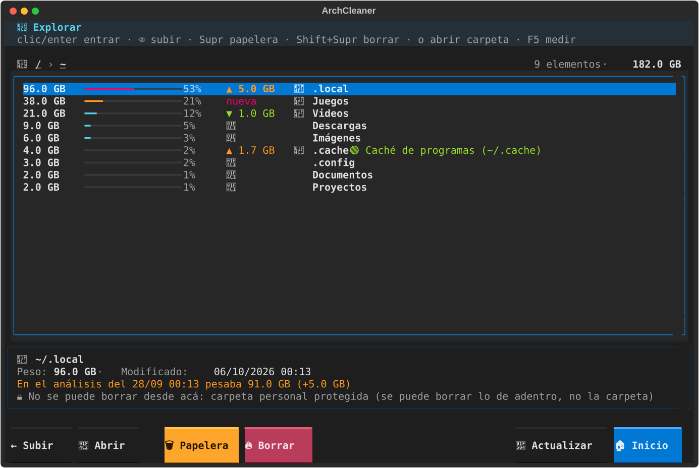

# 🧹 ArchCleaner

[](https://github.com/luchomart/archcleaner/actions/workflows/tests.yml)
[](LICENSE)


**🇦🇷 [Leer en español](README.md)**

A disk analyzer and cleaner for Arch Linux that runs in the terminal and works with the mouse. It
tells you **what is taking up space, why, and what can be deleted**. It also uninstalls programs
**without leaving a trace**.

> ℹ️ The interface is in Spanish for now. The screenshots below give you an idea of what each
> screen does. Translations are welcome.



No more going folder by folder hunting for what fills your disk. ArchCleaner scans your drives and
recognizes known junk: caches, logs, old packages, Steam leftovers, forgotten `node_modules`, and
more. It sorts what it finds into three levels:

| Level | Meaning | Pre-selected? |
|---|---|---|
| 🟢 Safe junk | Regenerates by itself; deleting it breaks nothing | Yes |
| 🟡 Review | Big and probably unneeded, but you decide | No |
| 🔵 Info only | Big, but not handled here (Steam games, Timeshift…) | — |

## 🛡️ Is it safe?

A tool that deletes things has to earn your trust. This is how ArchCleaner works:

- **Analyzing never deletes anything.** You can use it just to look.
- **Nothing is deleted before you see it.**
  - There is always a plan with the exact list of what will be deleted.
  - A **dry-run mode** (`simulacro`) shows everything without running anything.
- **Anything doubtful goes to the trash**, so you can restore it.
  - Permanent deletion is optional.
  - To confirm it, you have to **type `borrar`** ("delete").
- **It never runs as root.**
  - It asks for `sudo` only for the specific step that needs it, and you type the password yourself
    in the terminal.
  - Uninstalls are done by **pacman**, with pacman's own confirmation.
- **A last safety check covers every path** before it is deleted
  ([`seguridad.py`](archcleaner/seguridad.py)), even if something requests it by mistake. It never touches:
  - the system;
  - your home folder itself, or your personal folders such as Documents and Pictures;
  - whole drives;
  - files owned by an installed package.
- **Symlinks are deleted as links**, never what they point to.
- **Vital packages are protected.** The kernel, systemd, pacman, your desktop, drivers, the bootloader
  and similar packages are marked 🔒 and can't be uninstalled from ArchCleaner.
- **Anything that looks like game saves** (folders such as `saves` or `worlds`) is never pre-selected.
- **It can create a Timeshift snapshot** before uninstalling, so you can roll back if something goes wrong.
- **Everything is logged** in `~/.local/state/archcleaner/acciones.log`.
- **It is open source and tested.** 64 automated tests run on every change. They cover the safety
  rules, and they drive the app with mouse clicks inside a fake home folder.

## 📸 Screenshots

| Analysis | Choosing what to clean |
|---|---|
|  |  |
| **Permanent deletion: you must type "borrar"** | **Uninstall: sort by least used** |
|  |  |
| **What grew since last week** | **Explore folders by size** |
|  |  |

> The screenshots come from a demo machine, built by [`docs/generar_capturas.py`](docs/generar_capturas.py).

## 📦 Installation

**With the PKGBUILD.** This is recommended: ArchCleaner is installed as a package and removed
cleanly with pacman.

```bash
git clone https://github.com/luchomart/archcleaner.git
cd archcleaner
makepkg -si
```

**Without installing anything**, to try it out:

```bash
sudo pacman -S --needed python-rich python-textual
git clone https://github.com/luchomart/archcleaner.git
python archcleaner/archcleaner.py
```

**Optional packages:**
- `pacman-contrib`, to clean the pacman cache;
- `timeshift`, for snapshots;
- `flatpak`.

**Uninstall:** run `sudo pacman -R archcleaner`. ArchCleaner's own data (log, history, preferences)
is stored in `~/.local/state/archcleaner/`. Delete that folder if you don't want to keep it.

**Requirements:**
- Arch Linux, or a pacman-based derivative;
- Python 3.12 or newer;
- a modern terminal with mouse support, such as Konsole, Kitty, Alacritty, GNOME Terminal or WezTerm.

## 🚀 Usage

The commands are in Spanish. This is what each one does:

```bash
archcleaner                      # the app: a menu with everything (keyboard or mouse)
archcleaner analizar             # full report in the terminal (read-only)
archcleaner analizar --rapido    # quick: only known junk sources, without scanning whole drives
archcleaner limpiar --simulacro  # pick what to clean and see the plan, without deleting (dry run)
archcleaner limpiar              # same, but asks for confirmation and then runs it
archcleaner desinstalar          # pick a program from the list to uninstall
archcleaner desinstalar steam    # go straight to that program
archcleaner explorar ~/Downloads # browse folders sorted by size
archcleaner crecio --dias 7      # what grew in the last 7 days
```

Everything can be clicked.
- **🔄 Actualizar** (`F5`) rescans on any screen.
- **Alt+← / Alt+→** go back and forward. The side buttons of your mouse do the same, if your terminal
  sends them.

### 📦 Uninstalling without a trace

1. **Overview** (read-only). It shows:
   - which packages will be removed, including dependencies nothing else needs;
   - active services;
   - leftovers in your home folder and in the system that pacman doesn't know about.
2. **Choose the leftovers.** *Safe* ones (exact name match) come pre-selected. *Probable* ones don't.
3. **Plan → trash or permanent deletion → Timeshift snapshot (optional) → confirm.**
4. **Uninstall and verify.** ArchCleaner stops the services, uninstalls the program and deletes the
   leftovers. Then it checks again and shows either "Rastro: 0" (no trace left) or what remains and why.

It works with:
- programs from the official repos and the AUR (using `pacman -Rns`);
- Flatpak;
- AppImage;
- Steam games. ArchCleaner notices on its own when Steam has finished uninstalling, then cleans up
  shaders, Workshop content and Proton files.

The program list can be sorted by **size, least used, name or recently installed**.

### 📈 What grew

Every analysis saves a lightweight snapshot of your disk (about 20–100 KB).

You can compare the latest analysis with the previous one, or with one from a week or a month ago.
ArchCleaner shows a tree that points to the folder that actually grew. For example, it reports
`~/.local/share/Steam/steamapps/workshop +5 GB`, not just `~/.local +5 GB`.

You also see this information in three other places:
- in the report;
- in Explore, as ▲/▼ next to each folder;
- in the menu, as a small chart of free space over time.

### 📂 Explore

Explore lists files and folders from largest to smallest. Next to each one, it shows what
ArchCleaner knows about it, such as "🟢 cache", "game: …" or "workshop: …".

You can send items to the trash or delete them permanently. Either way, every path goes through the
safety check. Outside your home folder and your data drives, Explore is read-only.

## 🔍 What it checks

- **System:**
  - journald logs and coredumps;
  - modules of old kernels;
  - Timeshift snapshots older than 30 days (never the most recent one).
- **Pacman / AUR:**
  - the package cache and orphaned packages;
  - `.pacnew`/`.pacsave` files;
  - the yay/paru cache and `-debug` packages.
- **Flatpak:** unused runtimes and data from uninstalled apps.
- **Steam (all libraries):**
  - shaders, Proton prefixes and Workshop content of uninstalled games;
  - half-finished downloads and unused Proton versions;
  - the size of each game and of its Workshop content, with the name of each Workshop item.
- **Development:**
  - caches of npm, pip, go, cargo, gradle, maven and similar tools;
  - forgotten `node_modules` and `venv` folders.
- **Home:**
  - `~/.cache` and the trash;
  - old downloads;
  - leftovers of programs that are no longer installed.
- **Files:**
  - files over 1 GB;
  - installers you already used;
  - games installed outside Steam.
- **Size tree:** where the space goes, folder by folder, on each drive.

## 🛠️ For developers

```bash
python -m unittest discover -s tests     # tests (they never touch your files: they use a fake home)
python docs/generar_capturas.py          # regenerates the README screenshots
```

The code is in Spanish. Main modules:
- `acciones.py` is the only module that deletes anything.
- `seguridad.py` is the last check before anything is deleted.
- `detectores/` has one file per junk source.
- `tui/` contains the app, built with [Textual](https://textual.textualize.io/).

**Adding a junk source:**
1. Create `detectores/<name>.py` with a function `detectar(ctx) -> list[Hallazgo]`.
2. Register it in `DETECTORES`, in `detectores/__init__.py`.

Found a bug, or something ArchCleaner should detect? Open an [issue](https://github.com/luchomart/archcleaner/issues).

## License

[MIT](LICENSE) © luchomart
